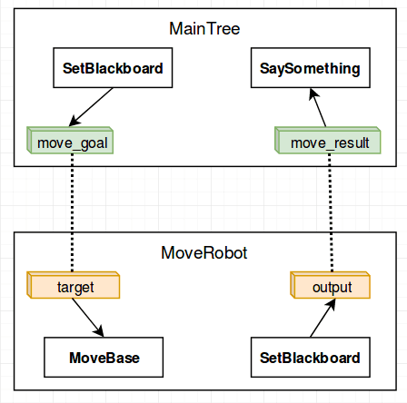

# Remapping ports between Trees and SubTrees 

In the CrossDoor example we saw that a `SubTree` looks like a single
leaf Node from the point of view of its parent (`MainTree` in the example).

Furthermore, to avoid name clashing in very large trees, any tree and subtree
use a different instance of the Blackboard.

For this reason, we need to explicitly connect the ports of a tree to those
of its subtrees.

Once again, you __won't__ need to modify your C++ implementation since this 
remapping is done entirely in the XML definition.

## Example

Let's consider this Beahavior Tree.

```XML hl_lines="7"
<root main_tree_to_execute = "MainTree">

    <BehaviorTree ID="MainTree">

        <Sequence name="main_sequence">
            <SetBlackboard output_key="move_goal" value="1;2;3" />
            <SubTree ID="MoveRobot" target="move_goal" output="move_result" />
            <SaySomething message="{move_result}"/>
        </Sequence>

    </BehaviorTree>

    <BehaviorTree ID="MoveRobot">
        <Fallback name="move_robot_main">
            <SequenceStar>
                <MoveBase       goal="{target}"/>
                <SetBlackboard output_key="output" value="mission accomplished" />
            </SequenceStar>
            <ForceFailure>
                <SetBlackboard output_key="output" value="mission failed" />
            </ForceFailure>
        </Fallback>
    </BehaviorTree>

</root>
```

You may notice that:

- We have a `MainTree` that includes a subtree called `MoveRobot`.
- We want to "connect" (i.e. "remap") ports inside the `MoveRobot` subtree
with other ports in the `MainTree`.
- This is done using the XMl tag __<remap>__, where the words __internal/external__
  refer respectively to a subtree and its parent.


The following image shows remapping between these two different trees.

Note that this diagram represents the __dataflow__ and the entries in the
respective blackboard, not the relationship in terms of Behavior Trees.



In terms of C++, we don't need to do much. For debugging purpose, we may show some
information about the current state of a blackboard with the method `debugMessage()`.

```C++
int main()
{
    BT::BehaviorTreeFactory factory;

    factory.registerNodeType<SaySomething>("SaySomething");
    factory.registerNodeType<MoveBaseAction>("MoveBase");

    auto tree = factory.createTreeFromText(xml_text);

    NodeStatus status = NodeStatus::RUNNING;
    // Keep on ticking until you get either a SUCCESS or FAILURE state
    while( status == NodeStatus::RUNNING)
    {
        status = tree.tickRoot();
        // IMPORTANT: add sleep to avoid busy loops.
        // You should use Tree::sleep(). Don't be afraid to run this at 1 KHz.
        tree.sleep( std::chrono::milliseconds(1) );
    }

    // let's visualize some information about the current state of the blackboards.
    std::cout << "--------------" << std::endl;
    tree.blackboard_stack[0]->debugMessage();
    std::cout << "--------------" << std::endl;
    tree.blackboard_stack[1]->debugMessage();
    std::cout << "--------------" << std::endl;

    return 0;
}

/* Expected output:

    [ MoveBase: STARTED ]. goal: x=1 y=2.0 theta=3.00
    [ MoveBase: FINISHED ]
    Robot says: mission accomplished
    --------------
    move_result (std::string) -> full
    move_goal (Pose2D) -> full
    --------------
    output (std::string) -> remapped to parent [move_result]
    target (Pose2D) -> remapped to parent [move_goal]
    --------------
*/
```


